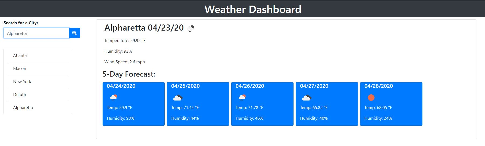

<h1><a href="https://miteshmodi003.github.io/Weather-Report/"> Weather Report</a></h1>
This goal of this assignment was to utilize OpenWeather APIs to make an application that displays current weather information for the city that a user inputs. The current weather information displayed includes the following:




# Description
* City's Name
* Today's Date
* Weather Icon (displaying current conditions)
* Temperature
* Humidity
* Wind Speed
* UV Index

##**Forecast for the next 5 days:**
* Date
* Icon
* Temperature
* Humidity
* Relevant class concepts from the week: Server-Side APIs, AJAX calls, JSON object format

## User Story

```
AS A traveler
I WANT to see the weather outlook for multiple cities
SO THAT I can plan a trip accordingly
```

## Acceptance Criteria

```
GIVEN a weather dashboard with form inputs
WHEN I search for a city
THEN I am presented with current and future conditions for that city and that city is added to the search history
WHEN I view current weather conditions for that city
THEN I am presented with the city name, the date, an icon representation of weather conditions, the temperature, the humidity, the wind speed, and the UV index
WHEN I view the UV index
THEN I am presented with a color that indicates whether the conditions are favorable, moderate, or severe
WHEN I view future weather conditions for that city
THEN I am presented with a 5-day forecast that displays the date, an icon representation of weather conditions, the temperature, and the humidity
WHEN I click on a city in the search history
THEN I am again presented with current and future conditions for that city
WHEN I open the weather dashboard
THEN I am presented with the last searched city forecast
```
